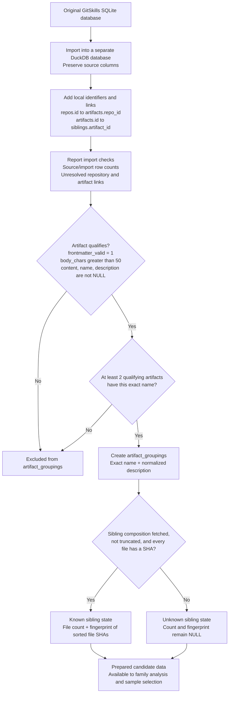
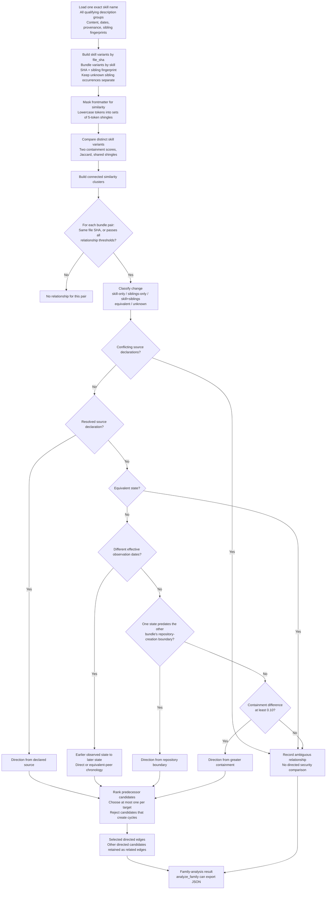
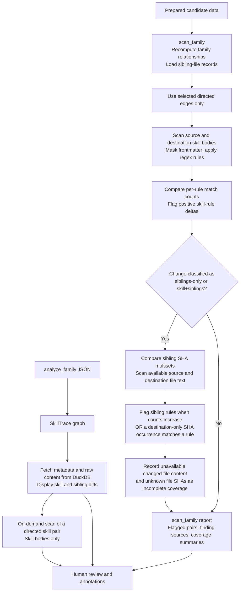
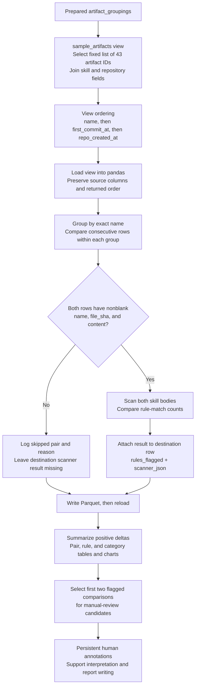

# Pipeline Walkthrough

This document traces the project's data flow from the GitSkills dataset to manually reviewed findings. It describes the implementation checked on **October 5, 2026**. Update it when the SQL, relationship policy, scanner, or notebook workflow changes.

The project shares one database-preparation stage, then follows separate family-analysis and Sprint 1 notebook paths. SkillTrace provides interactive review of family-analysis reports. These paths select comparisons differently and should not be treated as interchangeable.

## 1. Prepare the Data and Identify Candidates

### Import and eligibility decisions

- The import creates `repos`, `artifacts`, `artifact_siblings`, and `mining_runs` in DuckDB. It preserves source fields and adds local IDs and foreign-key-like links without creating primary-key constraints.
- Repository links use `repos.full_name = artifacts.repo_full_name`. Sibling links use repository name plus `artifacts.path = artifact_siblings.artifact_path`.
- Import validation queries report row counts and unresolved links. They provide checks to inspect rather than automatically asserting that every reported value is correct.
- Eligibility is based on repeated exact names, not repeated descriptions. A description variant occurring only once is retained when its name occurs in at least two qualifying artifacts.
- Description normalization lowercases, trims, and collapses whitespace. Names remain exact.
- The current grouping SQL does not require `dedup_primary = 1`, a particular location class, or available commit history. Its required fields are checked for NULL, not for blank strings.

### Sibling-state decisions

The sibling fingerprint is SHA-256 of the sorted, `|`-separated multiset of sibling-file `entry_sha` values. Duplicate occurrences are retained. Filenames, paths, and directory entries are excluded; actual file content is not read and rehashed.

The fingerprint is populated only when composition was fetched, was not truncated, and every sibling file has a SHA. A complete composition with zero files receives count `0` and `sha256('')`. Incomplete composition remains unknown rather than being treated as empty.

Imported IDs are locally generated using `row_number()`. The sample's fixed artifact IDs therefore depend on the prepared database's ID assignments; they are not portable source identifiers.

**Implementation:** [import SQL](../../sql/create_gitskills_duckdb.sql), [candidate grouping SQL](../../sql/create_analysis_tables.sql), [sibling fingerprint SQL](../../sql/update_artifact_groupings.sql), and [database creation script](../../bin/create_gitskills_db.sh).

## 2. Decide Which Family Comparisons Are Defensible

Both `analyze_family` and `scan_family` invoke `FamilyAnalyzer`. Each loads all qualifying artifacts for one exact name, including its different normalized-description groups. This family load is not restricted to the notebook's 43-artifact sample.

### Variant and similarity decisions

A skill variant represents one `file_sha`. A bundle variant represents that skill SHA plus its known sibling fingerprint. An artifact with unknown sibling state is kept separate using its artifact ID, even when its skill SHA matches another occurrence.

Representatives are selected by the earliest parseable `first_commit_at`, with artifact ID as a tie-break. If no usable observation date exists, the lowest artifact ID is selected. That representative supplies the artifact IDs used on reported edges.

Similarity excludes properly delimited top-of-file frontmatter, lowercases tokens, and builds sets of contiguous five-token sequences. Tokenization preserves common technical structures such as URLs, paths, flags, and environment variables where practical. Repeated identical shingles do not increase the set size.

The default relationship gate requires all three conditions for different file SHAs:

| Measure | Default requirement | Meaning |
| --- | --- | --- |
| Maximum directional containment | At least 0.80 | Most shingles from at least one skill appear in the other |
| Jaccard similarity | At least 0.30 | Enough overlap relative to the union of both sets |
| Shared shingles | At least 5 | A minimum amount of shared material |

Containment from A to B is `shared / shingles_in_A`; Jaccard is `shared / union`. These thresholds and the shingle size are configurable exploratory defaults, not final validated cutoffs.

Clusters are connected components. Two members can be connected through a third member without directly passing the relationship gate themselves. Individual bundle pairs still undergo the gate before receiving a relationship.

### Change and direction decisions

- Shingle equivalence means equal normalized shingle sets, not necessarily identical raw text.
- Unknown sibling state yields change type `unknown`. With known sibling state, body equivalence and fingerprint equality determine `equivalent`, `siblings-only`, `skill-only`, or `skill+siblings`.
- Supported source declarations are `derived_from`, `upstream_skill`, `source_repo`, and `upstream_source`. They are resolved conservatively within the loaded family. Conflicting declarations leave the relationship ambiguous.
- Without a resolved declaration, equivalent states remain peers. Other pairs proceed through chronology, repository boundaries, and containment.
- Effective chronology uses the earliest observation of an equivalent state. A peer can supply that observation only when the body representation is equivalent and the sibling fingerprint is known and equal. The peer date does not become the artifact's own commit date.
- Repository creation is a boundary, not a skill timestamp. A bundle's boundary is available only if every member has a parseable repository creation date; it uses the earliest of those dates.
- The containment fallback requires an absolute difference of at least `0.10` between the two containment scores. The greater-containment direction becomes the inferred source-to-target direction.

For each target, predecessor selection ranks candidates by direction basis: declared source, direct chronology, equivalent-peer chronology, repository boundary, then containment. Further ordering uses evidence count, temporal proximity for chronology candidates, containment, Jaccard, shared shingles, and source representative ID. The algorithm takes the first candidate that does not create a cycle, giving each target at most one selected predecessor.

Other directed candidates remain `related_edges`; unresolved relationships remain `ambiguous_edges`. Nodes without a selected incoming edge are root candidates, not proven original sources. Inferred edges do not prove copying or authorship.

**Implementation:** [family loader](../../src/gitskills/data/families.py), [family analysis](../../src/gitskills/analysis/family.py), [similarity](../../src/gitskills/analysis/similarity.py), [policy and models](../../src/gitskills/analysis/family_models.py), and [provenance parsing](../../src/gitskills/analysis/provenance.py).

## 3. Scan Directed Relationships and Review the Evidence

`scan_family` recomputes family relationships and scans the selected directed edges. SkillTrace instead loads `analyze_family` JSON reports and offers interactive content inspection and skill-pair scans. SkillTrace does not load `scan_family` reports as its graph input.

### Skill-body scanning

The default scanner contains 12 regex rules across command execution, network access, filesystem access, credential access, external code execution, and system modification. It evaluates text rather than executing instructions or resolving general program flow.

Skill scans mask properly delimited frontmatter while preserving source positions and line numbers. The comparator reports:

- per-rule source and destination counts, with deltas only where counts differ;
- total match counts and their difference; and
- newly present risk categories, calculated as destination categories minus source categories.

For skill-body findings, `scan_family` flags only positive per-rule deltas. A change from one match to two can be flagged even though that rule and category already existed. Equal counts can hide changed commands, paths, or destinations. The shell-block rule detects supported opening fence labels; it does not compare the contents of corresponding code blocks.

### Sibling scanning and coverage

Sibling scanning runs only for edges classified as `siblings-only` or `skill+siblings`. It loads file entries for the selected representative source and destination artifacts.

Sibling differences are computed by SHA multisets, retaining extra occurrences and excluding paths from matching. The scanner evaluates all available source and destination file text without masking frontmatter. If a file lacks content, content from another loaded sibling with the same SHA can supply it. Scans are cached by SHA, or by sibling ID when SHA is unavailable.

Rules are flagged when their aggregate destination count increases, or when a destination-only SHA occurrence contains a match. Consequently, a changed sibling file can produce a finding even when aggregate rule counts remain equal. This does not establish which filename was modified; the SHA difference identifies unmatched content occurrences.

Coverage summaries record unavailable content for source-only or destination-only files and unknown file SHAs. These can produce an incomplete-pair record even without a flagged finding. Edges with unknown bundle sibling state do not enter the sibling-scan branch, so an unflagged result does not establish complete coverage.

`scan_family` analyzes selected predecessor edges, not every related edge. Ambiguous relationships are counted as skipped. Its report preserves flagged pairs and coverage information alongside analyzed-pair counts.

### SkillTrace review

SkillTrace reads family structure from saved `analyze_family` reports, then queries DuckDB for current artifact metadata, content, sibling files, and diffs. Its on-demand scan verifies a directed relationship and scans the two skill bodies; it does not invoke the sibling-security analysis above. Sibling diffs are available for human inspection.

**Implementation:** [family security analysis](../../src/gitskills/analysis/family_risk.py), [sibling loader](../../src/gitskills/data/siblings.py), [scanner](../../src/gitskills/analysis/analyzer.py), [comparator](../../src/gitskills/analysis/comparator.py), [rule registry](../../src/gitskills/rules/registry.py), and [SkillTrace](../../apps/skilltrace/app.py).

## 4. Extract and Explore the Sprint 1 Sample

The notebook follows a separate exploratory route. Its adjacent comparisons do not apply the family-analysis relationship or direction decisions above.

### Selection and comparison decisions

The view selects a fixed list of artifact IDs from `artifact_groupings`, then inner-joins artifacts and repositories. The expected 43 rows require the selected IDs and join partners to exist. The view stores a query rather than a separate copy of those records.

The notebook preserves the view's returned order, groups by exact name, and compares each row with the immediately preceding row in that group. A group of `n` rows yields `n - 1` opportunities. The saved Sprint 1 sample has 43 artifacts across 10 names, yielding 33 adjacent comparisons. Tied dates have no explicit artifact-ID tie-break in the view.

Both members of a pair must have nonblank name, file SHA, and content. An invalid row skips comparisons that use it; the notebook does not bridge across that row to another valid predecessor.

This path has no similarity gate, provenance resolution, predecessor selection, or sibling-content scanning. Adjacent records are comparison candidates, not automatically established parent/child relationships.

### Results and manual review

The output preserves all source columns and adds:

| Field | Meaning |
| --- | --- |
| `rules_flagged` | Nullable integer count of distinct rules with positive match-count deltas |
| `scanner_json` | Serialized comparison with category introduction, match counts, rule deltas, and source/destination profiles |

A group's first row has no comparison result. A successfully scanned pair with no positive deltas receives `0`, while an unscanned row remains missing. Results are attached to the destination row. The scan log retains pair identities and skip reasons in notebook memory; it is not included as a separate table in the Parquet export.

The notebook writes `sample_artifacts_scanner_results.parquet`, reloads it, and computes pair-, rule-, and category-level summaries. Rule summaries distinguish the number of flagged pair/rule events from the number of additional matches. It generates `pair_scan_outcomes.png`, `flagged_rules.png`, and `flagged_risk_categories.png`.

Output paths depend on the working directory. With the kernel working directory set to `../../notebooks/extraction_pipeline`, Parquet is written under that directory's `results/` and figures under its `figures/`. Other starting directories can produce different locations.

The generated manual-review table selects the first two flagged comparisons and resets annotation fields to `TODO` on rerun. Completed human reviews are preserved separately in persistent Markdown cells.

**Current traceability limitation:** the view exposes `artifact_groupings.id` as `id`, alongside the actual `artifact_id`. The notebook currently uses `row.get("id")` for its logged `base_id` and `derived_id`, so those values are group IDs. Actual artifact IDs remain in the preserved source columns. Reviewers should verify the artifact IDs and SHAs of the exact pair inspected.

**Implementation:** [sample view](../../sql/create_sprint1_samples_view.sql), [notebook](../../notebooks/extraction_pipeline/samples_extraction_and_exploration.ipynb), and [notebook instructions](../../notebooks/extraction_pipeline/README.md).

## Interpretation and Sprint 2 Planning

Human review connects the generated evidence to the [research question](../../RESEARCH_QUESTION.md). A detected change does not by itself establish malicious intent, execution, or harm. The [report](../../report/README.md) records results and interpretations; writing research conclusions is not an automatic pipeline stage.

The following remain planning or validation topics rather than claims of completed functionality:

- Review threat-model and rule coverage, including IP-address references and missed command keywords such as `bun`. The current registry has no dedicated IP-address rule, although HTTP/HTTPS URLs containing IP addresses can match the URL rule.
- Compare actual code-block or matched-evidence content so equal rule counts do not hide meaningful changes. [RDR-008](../decisions/RDR-008-evidence-representation-and-comparison.md) describes proposed evidence representation and comparison.
- Decide how existing sibling scanning should be validated and integrated into notebook and interactive scan workflows, including handling unknown composition and unavailable content.

This walkthrough describes code behavior, not a fresh execution of the full dataset. Saved Sprint 1 counts are an exploratory baseline, not population-wide risk estimates.
